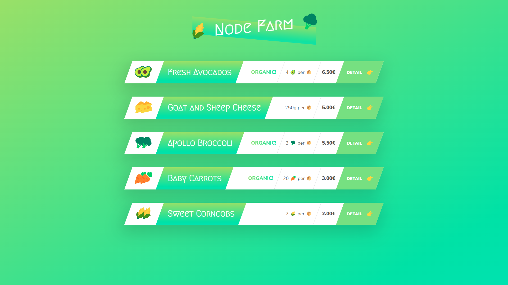
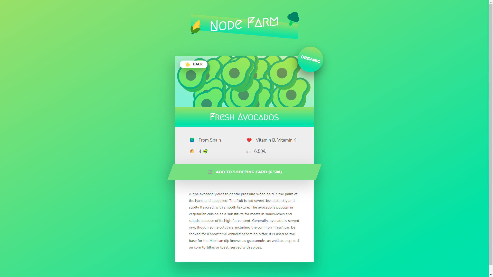

# node-farm
Built this project while Learning Node Js. Learnt about routing, templating, npm packages.

# Screenshots

# Running the project
Execute the following commands:
- `npm install`
- `npm run start`
- go to `127.0.0.1:8000` from the browser to view the project
